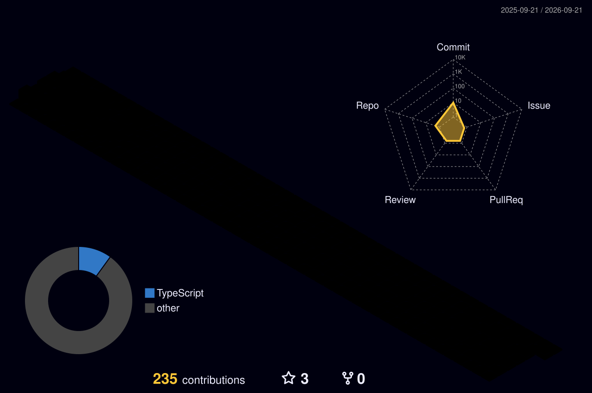

<!---->

  
  # Stats ncrrr ^_^

  

---
### 🛠️ Mes compétences
- **Langages** : TypeScript, JavaScript, HTML/CSS, Bash
- **Outils** : Git, Docker, Arch Linux, MacOS, WebStorm
- **Self-host** : VaultWarden, GitLab, Pi-Hole, Uptime Kuma, Tor Relay, Push server.

